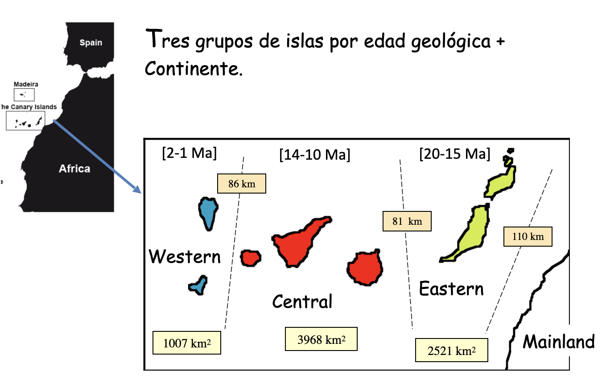
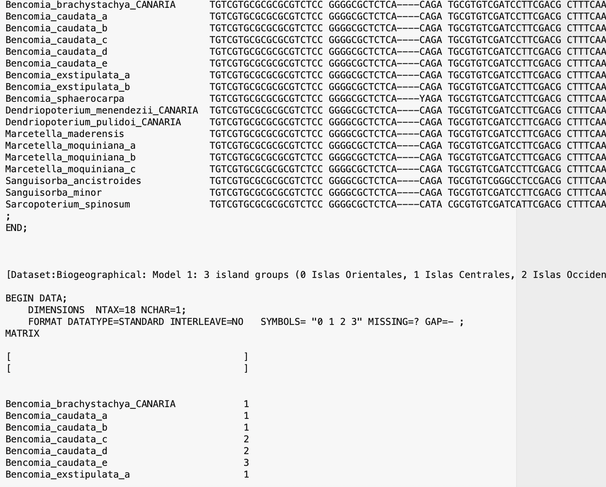

# Setting a biogeographic analysis with BIB

In this tutorial, we are going to program a Bayesian inference biogeographic analysis in RevBayes with the BIB model and the `Rev` language and an empirical dataset, consisting on a set of clades that are distributed in the same set of areas As we have learnt from the lectures, the BIB model includes only two components: the *Distribution-coded discrete areas* and the *anagenetic component: the Q matrix*. There is no *cladogenetic component: range inheritance scenarios*. The aim is to estimate commonalities in patterns of range evolution: in particular, can we learn any rules about the rate of migration or dispersal between areas by estimating those rates across multiple clades that share a common biogeographic setting or area distribution.

## Study group

We will work with a set of nine clades that are distributed in the Canary Islands, a volcanic archipelago located in the Atlantic Ocean, close to northwest Africa. 
These clades (genera, tribes, "generic-alliances) differ in the number of species and taxonomically (they belong to different groups of organisms: e.g., insects, angiosperms, millipeda), and have different ecological preferences; however, they share a common distribution (even though not every clade is distributed in exactly the same set of islands). The Canary Islands were formed by the African plate moving over a "hotspot" (a permanent source of magma) in the Atlantic Ocean; unlike Hawaii, another hotspot archipelago, their volcanic history was also influenced by tectonics, i.e., a continental fracture propagating from the African Atlas mountain range. All islands were formed in the last 20 million years, with the eastern islands (Lanzarote, Fuerteventua) being the oldest, and the westernmost islands (La Palma, El Hierro), the youngest.

*The Canary Islands are formed by seven major islands, with different sizes and ages. 

## Data description and access

First, download the datasets and scripts needed to complete the task.
Move into the `BIB` folder, where you can find all scripts and files needed for the practice.  Inside this folder, you will find a second folder called `data`. Copy the contents of this file into your computer: it contains the datasets of the nine clades, e.g., *Inulinae.nex* .

Take a look at each of these datasets. You will note that unlike DEC, BIB works with raw DNA sequence alignment. This means that we will be inferring the phylogeny, the evolutionary relationships between species, jointly with patterns and rates of range evolution. 
There are two components on each dataset: the first matrix contains the DNA alignment and the character states are the nucleotides (e.g., A, C, T, G). The second matrix contains the biogeographic states: only one column with each species (or DNA sequence voucher) coded by distribution.

*Data structure of a BIB model

Area coding follows Sanmartin et al. (2008), and divides the Canary Islands into three "geological" groups of islands (islands that were formed in the same geological pulses over the last 20 million years: *Eastern Islands (1)*: Lanzarote (15 Ma) and Fuerteventura (20 Ma), *Central Islands (2)*: Gran Canaria (14 Ma), Tenerife (12 Ma) and Gomera (10 Ma), and *Western Islands (3)*: La Palma (2 Ma) and El Hierro (0.8 Ma). Finally, we will consider a fourth state to allow lineages to migrate into the Canary Islands, *Mainland (0)*: Iberian Peninsula, other Macaronesian archipelagos, Africa.


## Launching RevBayes
Launch RevBayes by typing `./rb` if your are using the Terminal, or `rb-mpi` if you are using the parallel version in a cluster command line. This should launch RevBayes and give you a command prompt (the `>` character); this means RevBayes is waiting for input.

## Constructing the BIB model *interactively*

First, we will build the molecular part of the model.

We assume each group has its own molecular model, but shares the biogeographic model.


Read in all molecular data matrices into the vector D
Read in all biogeographic matrices into the vector B
```

filenames <- [  "Input/Bystropogon.nex",
                "Input/Calathus.nex",
                "Input/Dolichoiulus.nex",
                "Input/Lotus.nex",
                "Input/Micromeria.nex",
                "Input/Lotus.nex",
                "Input/Pimelia.nex",
                "Input/Psyllids.nex",
                "Input/Tolpis.nex"
              ]
```

Create a loop
```

for ( i in 1:filenames.size() )
{
    X <- readDiscreteCharacterData( filenames[i] )

    D[i] <- X[1]
    B[i] <- X[2]
}
```

Next, we define the molecular model for each group. We do it in a loop with four steps:

1. Define the priors for the two elements of the Q substitution rate matrix: the exchangeability or transition rates between nucleotides `r_M` and the stationary or equilibrium frequencies for each nucleotide `p_M`. Since these two parameters are stochastic variables in our model, we assign them some priors: in this case, Dirichlet priors.
p[i] ~ dnDirichlet( v(1,1,1,1) )
r[i]  ~ dnDirichlet( v(1,1,1,1,1,1) )

2. Build the Q instantaneous rate matrix. Notice that as in the DEC model, Q is a deterministic node, since it is estimated as a function that depends on two types of stochastic variables or parameters, r[i] and p[i] 
Q[i] := fnGTR( r[i], pi[i] )
3. Assign clock rates to each group. We use an exponential prior with expectation 1/1000=0.001 because the dataset is made up of chloroplast markers, which are typically between  10E-4 and 10E-3.
clockRate[i] ~ dnExponential( 1000.0 ) 
4. Assign a tree prior: a birth-death prior setting the rate of speciation and extinction. Typically, we do not estimate speciation and extinction directly but two indirect parameters: the net diversification rate: the rate of speciation minus the rate of extinction; the turnover rate: the ratio of extinction over the speciation rate. We set the mean of the diversification prior to correspond to an expectation of 20 lineages in 3.0 Myr, i.e. exp(rT) = 20 when T = 3 and r = 1. For the turnover, we use an uninformative prior. We then convert these two estimates to the underlying parameters. 
diversification[i] ~ dnExponential( 1.0 )
turnover[i] ~ dnUniform(0.000001,0.999999)    
5. We set the root age: anywhere from 0 to 20 Myr old. Age of Canary Islands goes from 0.8 (El Hierro) to 20 Ma (Fuerteventura)
rootAge[i] ~ dnUniform( 0.000001, 20.0 )
6. We define the complete tree model for each group: tau[i] ~ dnBirthDeath function
7. We add rate heterogeneity across sites in the DNA sequence (allowing substitution rates to be higher for some (variable) sites and lower for other (conserved) sites. We use a discretized gamma model with four categories: alpha_M[i] ~ dnExponential(1.0)
8. We build the complete model `seq` from all seven components.
9. We "clamp" the model, assigning it the data.
10. We add the moves.
    
```

mvi = 1

 
for ( i in 1:D.size() )
{
    
    pi_M[i] ~ dnDirichlet( v(1,1,1,1) )
    r_M[i]  ~ dnDirichlet( v(1,1,1,1,1,1) )


    Q_M[i] := fnGTR( r_M[i], pi_M[i] )

    
    clockRate_M[i] ~ dnExponential( 1000.0 ) 

        
    diversification[i] ~ dnExponential( 1.0 )
    turnover[i] ~ dnUniform(0.000001,0.999999)


    lambda[i] := diversification[i] / abs(1.0 - turnover[i])
    mu[i]     := turnover[i] * lambda

    
    rootAge[i] ~ dnUniform( 0.000001, 20.0 )
    
 


    tau[i] ~ dnBirthDeath(  lambda = lambda[i],
                            mu = mu[i],
                            rootAge = rootAge[i],
                            rho = 1.0,
                            samplingStrategy = "uniform",
                            condition = "time",
                            nTaxa = D[i].ntaxa(),
                            names = D[i].names()
                        )

    alpha_M[i] ~ dnExponential(1.0)

    probs <- v( 0.125, 0.375, 0.625, 0.875 )

    for ( j in 1:4 )
        siteRates_M[i][j] := qgamma( probs[j], alpha_M[i], alpha_M[i] )

    seq_M[i] ~ dnPhyloCTMC( tree        = tau[i],
                            Q           = Q_M[i],
                            branchRates = clockRate_M[i],
                            siteRates   = siteRates_M[i],
                            nSites      = D[i].nchar(),
                            type        = "DNA"
                          )

    seq_M[i].clamp( D[i] )
    
    # add moves
    moves[ mvi++ ] = mvScale(clockRate_M[i],lambda=1,tune=true,weight=1)
    moves[ mvi++ ] = mvScale(rootAge[i],lambda=1,tune=true,weight=1)
    moves[ mvi++ ] = mvScale(diversification[i],lambda=1,tune=true,weight=1)
    moves[ mvi++ ] = mvScale(turnover[i],lambda=1,tune=true,weight=1)
    moves[ mvi++ ] = mvNNI(tau[i], weight=10.0)
    moves[ mvi++ ] = mvFNPR(tau[i], weight=10.0)
    moves[ mvi++ ] = mvSubtreeScale(tau[i], weight=5.0)
    moves[ mvi++ ] = mvNodeTimeSlideUniform(tau[i], weight=10.0)
    moves[ mvi ] = mvScale(alpha_M[i], lambda=1, tune=true, weight=1.0)
    
    
}

   
