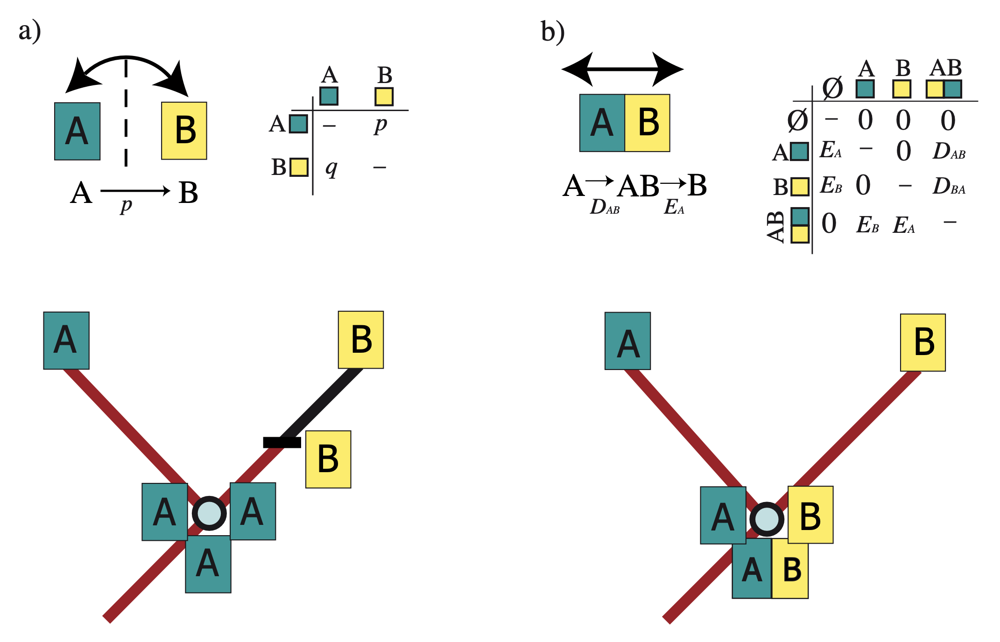

# Introduction to the Dispersal-Extinction-Cladogenesis (DEC) Model in RevBayes

Instructor: **Isabel Sanmartin**

For a very good introduction to the DEC model, go to [Tutorials Biogeography](https://revbayes.github.io/tutorials/biogeo/biogeo_intro.html)

### Parametric biogeographic models

The last decade has witnessed the introduction of parametric approaches in biogeography (Ronquist & Sanmartin, 2011). A common feature of these methods is the use of statistical probabilistic models, whose variables or parameters are quantifiable biogeographic processes that are dependent on time. In addition to the tree topology and species distributions, parametric models incorporate a third source of information: branch lengths—measured in numbers or units of time—provide direct evidence on the rate or probability of geographic evolution. Longer branches imply a higher probability of changes in geographic range than shorter branches. As more time elapses since the divergence of the species from its ancestor, there is more opportunity for biogeographic change along the branch (by dispersal, extinction, or range expansion). Branch lengths also inform on the certainty or degree of error in biogeographic inference: a species subtended by a long branch would be associated with a higher uncertainty about its ancestral range than one subtended by a short branch (Sanmartin, 2022).
 

One popular parametric approach in biogeography is the continuous-time Markov Chain (CTMC) model, a parametric model with stochastic variables that are time-dependent. CTMC models are typically used to describe range evolution at the species level. A Markov chain is a stochastic, memory-less process that models transitions between discrete states over continuous or discrete-time; the probability of each transition event depends only on the state attained in the previous event.
CTMC models are used in historical inference disciplines, such as molecular evolution (nucleotide substitution models), morphological evolution, or phylogenetic biogeography, where the states observed in the present are the result of a stochastic process that evolves over time. Stochastic means that, unlike in a deterministic process, the outcome of the process cannot be predicted with certainty, i.e., we cannot predict the result of evolution. At the same time, evolutionary processes are not entirely random or unpredictable: they can be described by probability distributions with parameters, whose values we infer from the data.

Figure 1 provides an overview of a CTMC model (Sanmartin, 2022). The states of the CTMC are discrete geographic areas (A, B) that form the distribution range of a taxon (A, B), and transitions between states (A to B, B to A) are governed by an instantaneous Q matrix with rate parameters (q, p) that are estimated from the data. Transitions between states (A to B) are governed by an instantaneous Q matrix with rate parameters (q) that are estimated from the data. Given a phylogeny with time-calibrated branch lengths, tip distributions coded as discrete entities (A, B), and a stochastic CTMC model of range evolution (Q matrix, Fig. 1), one can estimate the probability of range evolution (by dispersal, extinction, range expansion) as a function of time, using statistical inference approaches such as Maximum Likelihood or Bayesian Inference.

*Parametric models in biogeographic inference. Top: A continuous-time Markov Chain (CTMC) process is used to describe the probability of range evolution; the states of the CTMC are discrete geographic ranges , a.*

The first two parametric methods developed in biogeography (Figure 1) were the Bayesian Island Biogeography (BIB) model (Sanmartín et al. 2008) and the Dispersal-Extinction-Cladogenesis (DEC) model (Ree et al. 2005; Ree and Smith 2008). We will focus on the latter here.

 

The DEC model (Fig. 1b) was originally implemented in a ML framework (Ree and Smith 2008), and later extended to BI (Landis et al. 2013), but it is typically applied to a phylogeny with fixed topology and branch lengths. It is the parametric equivalent to the popular parsimony biogeographic method, Dispersal-Vicariance-Analysis (DIVA, Ronquist, 1997).

It consists of three components:

1. _Discrete area ranges__: Like DIVA, DEC uses ancestral ranges as biogeographic units: these are the states in the CTMC Q matrix. Ancestral ranges in DEC can be formed by a single area (A, B, C) or by combinations of multiple discrete areas (AB, AC, ABC, Figure 1b). These widespread area ranges are encoded in DEC as presence-absence data, that is, if a species is present in areas A and C but not in B, its range equals to AC. In RevBayes DEC, these ranges are encoded into the length-3 bit vector, 110 and 101. Bit vectors may also be transformed into (decimal) integers, e.g., 0, 1, 2, etc.

2. _Anagenetic events__: Transitions between geographic states along branches are governed by two parameters (Fig. 1b): range expansion, where an additional area is added to the current range (DAB = A to AB), and range contraction, with the removing of an area from the ancestral range (EB = AB to B). Notice that instantaneous transitions between single-area states are not allowed in DEC. Moving between single areas requires going through a widespread state in which the ancestor is present in both areas (Fig. 1b). This can be observed in the Q matrix, with zero rate values for direct transitions between A and B (Fig. 1b). A transition from A to B requires two consecutive instantaneous events: range expansion from A to AB and range contraction from AB to B. 

3. _Cladogenetic events__Unlike the nucleotide CTMC model, the DEC model requires an additional cladogenetic component describing the different ways (range inheritance scenarios) by which a widespread ancestral range is divided between the two descendants. In Figure 1b, this involves vicariance, range division into non-overlapping subsets (A/B), but other possible range inheritance scenarios are "peripheral isolate speciation" (Ree et al. 2005), in which one descendant inherits the whole ancestral range and the other descendant inherits only one area (AB/B); or "widespread sympatry", in which the two descendants inherit the widespread ancestral range (AB/AB; Landis et al. 2013). In the original ML implementation of DEC (Ree and Smith, 2008), all these range inheritance scenarios are assigned equal relative likelihoods or "weights". In the BI implementation (Landis 2017), different prior probabilities can be assigned to the speciation modes.
