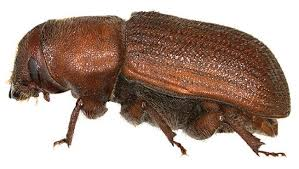
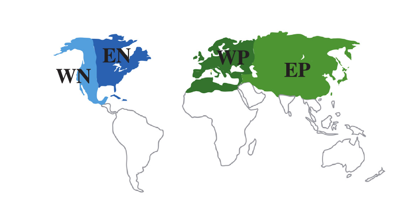
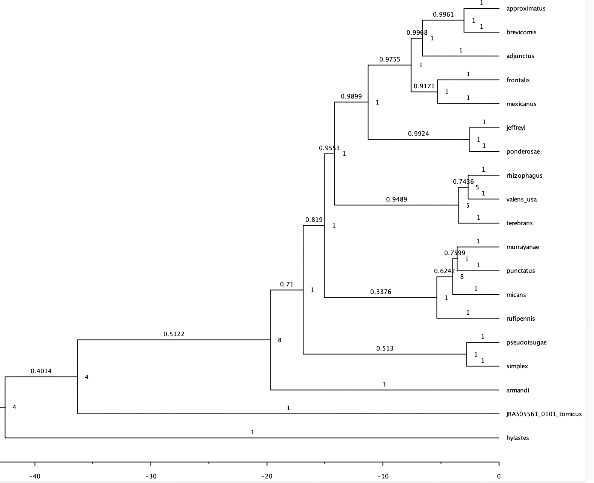
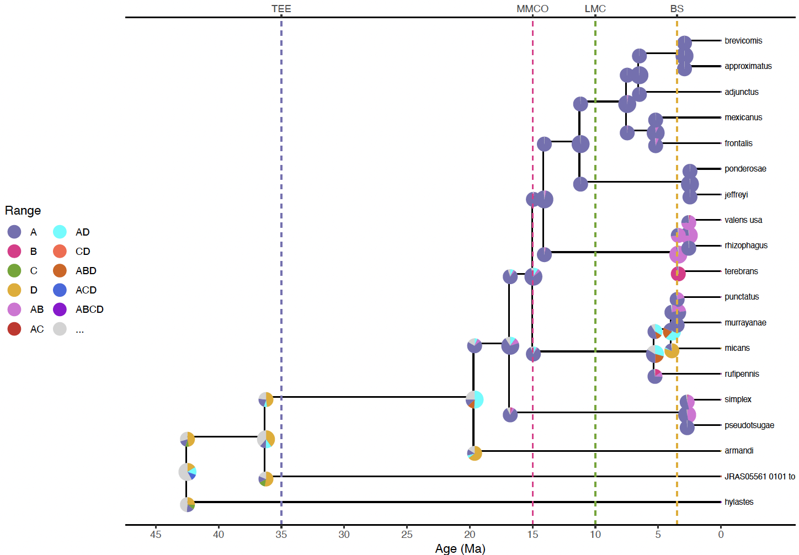
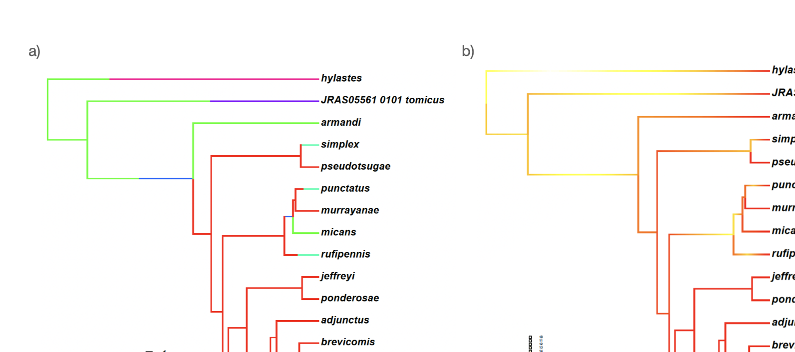

# Setting a biogeographic analysis with DEC

In this tutorial, we are going to program a Bayesian inference biogeographic analysis in RevBayes using the using the `Rev` language and an empirical dataset: Dendroctonus. The three main components (that we have learned about so far) are *the Distribution-coded discrete areas*, the *anagenetic component: the Q matrix* and *the cladogenetic component: range inheritance scenarios*. We will program them in this order.

## Study group

The Tutorial in RevBayes (website) presents an application of DEC to the silversword alliance, a clade of angiosperm plants that are endemic to Hawaii.
The original description of the DEC model in Lagrange (Ree & Smith, 2008) also analyzed an island clade (Psychotria). But the first description of the model was on continental biogeography (Ree et al. 2005).

We will work with a genus of beetles, **Dendroctonus**, one of the most economically important conifer-feeding genus of bark beetles (Curculionidae) and a major pest. The genus includes 20 species feeding under the bark of conifer species belonging to **Picea**, **Pinus**, **Larix** and **Pseudotsuga** groups. Most **Dendroctonus** species are native to North America, while two species naturally occur in Eurasia (**D. micans** and **D. armandi**). 
It was traditionally considered that **Dendroctonus** originated in Mexico from species that fed on **Araucaria**. This hypothesis is supported by the high diversity of species occurring in Mexican mountain ranges (13 spp). Other studies suggested that the genus originated in the northern areas of North America. 
Here, we will be using data from a recent phylogeny for the genus published by Godofreid et al. (2018) based on RAD-seq genomic data.

*Dendroctonus, a genus of bark beetles (Scolytidae) that feeds on conifers.


## Data description

Move into the `DEC` folder, where you can find all data files needed for the practice inside the folder `data`: *Dendroctonus-range.nex* and the *Dendroctonus.tre* .


Take a look at the *Dendroctonus-tree.tre* file. It contains a dated molecular phylogeny of the genus, with branches measured in units of time, as million years (Mya). 

Next, take look at the *Dendroctonus.range.nex*. It includes the distribution of 19 species and 2 outgroup taxa, encoded as presence-absence data. 
Area coding follows Sanmartin et al. (2001), and divides the Holarctic landmasses into four continental cratons (landmasses that remained emerged for the last 65 Mya and which are separated by biogeographic barriers): *Western Palearctic (WP)*: Eurasia west of the Ural Mountains, equivalent to Europe), *Eastern Palearctic (EP)*: Eurasia east of the Ural Mountains: Asia, *Western Nearctic (WN)*: North America west of the Rocky Mountains, and *Eastern Nearctic (EN)*: North America east of the Rocky Mountains. These four landmasses were connected at different times in the past: for example, Eastern North America and Europe were connected across a narrow Atlantic via landbridges between 55 and 20 Mya; Western North America and Asia remained connected even longer, up to the opening of the Bering Strait in the Mid Pliocene (3.5 Mya).

*Distribution range of Dendroctonus with four Holarctic regions.

Because there are four discrete areas and we accept all possible combinations, the area ranges used in this exercise are 15 + the empty set (the species is absent from all areas).

|   Range     | Areas |  Size |  State  |
|-------------|-------|-------|---------|
|$\emptyset$  | 0000  |    0  |     0   |
|A            | 1000  |    1  |     1   |
|B            | 0100  |    1  |     2   |
|C            | 0010  |    1  |     3   |
|D            | 0001  |    1  |     4   |
|AB           | 1100  |    2  |     5   |
|AC           | 1010  |    2  |     6   |
|AD           | 0110  |    2  |     7   |
|BC           | 1001  |    2  |     8   |
|BD           | 0101  |    2  |     9   |
|CD           | 0011  |    2  |    10   |
|ABC          | 1110  |    3  |    11   |
|ABD          | 1101  |    3  |    12   |
|ACD          | 1011  |    3  |    13   |
|BCD          | 0111  |    3  |    14   |
|ABCD         | 1111  |    4  |    15   |

## Launching RevBayes
Launch RevBayes by typing `./rb` if your are using the Terminal, or `rb-mpi` if you are using the parallel version in a cluster command line. This should launch RevBayes and give you a command prompt (the `>` character); this means RevBayes is waiting for input.

## Constructing the DEC model *interactively*

First, assign the tree and geographic range files (these are contained in your folder "data"; notice that you need to be one level above).
Create a directory for the output file. We called it `output/simple`.

```

range_fn = "data/Dendroctonus.range.nex"
tree_fn  = "data/Dendroctonus-tree.tre"
out_fn   = "output/simple"
```

### Building the Discrete Distribution model

First, we read the binary (01) presence-absence range data contained in "range_fn"

```
dat_range_01 = readDiscreteCharacterData(range_fn)
```
Convert binary ranges into NaturalNumbers readable by the machine (as in Table 1)
```
dat_range_n = formatDiscreteCharacterData(dat_range_01, "DEC")
```
Record the number of areas (characters) from the discrete data object
```
n_areas  = dat_range_01.nchar()
```
Compare the two types of coding for Taxon [1]: **Dendroctonus picea**

As human-readable presence-absence data: 1000
```
dat_range_01[1]
```
And as machine-readable natural numbers:  1
```
dat_range_n[1]
```
We want to record the relationship between range states and range labels when producing an ancestral range estimate figure. First, store the vector of range state descriptions.
```

state_desc = dat_range_n.getStateDescriptions()
```

Write the state descriptions to a file using a loop function
```
state_desc_str = "state,range\n"
for (i in 1:state_desc.size())
{
    state_desc_str += (i-1) + "," + state_desc[i] + "\n"
}
write(state_desc_str, file=out_fn+".state_labels.txt")
```

### Create a vector of movement proposals for `MCMC`
REMEMBER that in Bayesian Inference, a simulation approach called *Markov Chain Monte Carlo* is used to approximate the posterior probability of the phylogenetic model, as we cannot estimate this quantity analytically. For this, a composite *continuous-time Markov Chain* process (`CTMC`) with as many variables as parameters in the model is constructed, which has as its stationary distribution the posterior probability we wish to estimate. Using *Monte Carlo* simulations coupled with the *Metropolis-Hastings* algorithm, we update starting random values for each parameter in such a way that we approximate the stationary distribution by maximizing the likelihood in each step of the `CTMC` (climbing the "mountain") but occasionally allowing for a decrease in the (ln) Lk value. 
To perform this *updating*, we need movement proposals for each parameter, whose type depend on the parameter itself, e.g., *sliding window* for uniform parameters, *scale values* for rate parameters. Each movement proposal is accompanied by a *weight*, a constant variable with an assigned fixed value, which determines how often the parameter is updated during the MCMC analysis: the higher the weight, the more frequent the movement.

First, we create an empty vector, called `moves`, which we will populate with the different *movement proposals* we need for each parameter in the model. The alternative option is to define a *move* after we define a parameter, but using this vector allows us to keep track of how many moves we have to create.
We also create an empty vector for the monitors (to record the ouput). Finally, we assign the number of generations we want the MCMC to run (we leave it as 3,000 as in the tutorial but a longer run will allow us to better capture the posterior).
```
moves = VectorMoves()
monitors = VectorMonitors()
n_gen = 3000
```

### Build the Anagenetic component of the model: the CTMC Q matrix

Read the tree. If there is more than one tree, we keep an index. For this tutorial, we assume we know the dated species phylogeny
without error
```
tree <- readTrees(tree_fn)[1]
```
Next, we build the anagenetic rate matrix for the DEC model. In its simplest form, the rate matrix requires a dispersal rate and an
extirpation rate. We assume that all pairs of areas share the same dispersal rate and all areas share the same extirpation rate.
In order for anagenetic event rates to be measured on an absolute time scale (e.g., in millions of years)
we introduce a biogeographic rate parameter, similar to the molecular clock parameter used in dating analyses.

Set the biogeographic rate parameter prior. As in the [Tutorials Biogeography](https://revbayes.github.io/tutorials/biogeo/biogeo_intro.html), this is set to be quite broad or uninformative. `log10_range_bg` is set as a uniform distribution bounded 
between 0.0001 (10exp(-4)) and 100 (10exp(2)), with an initial value of 0.01 (10exp(-2)). We then assign a move to the rate parameter.
```
log10_rate_bg ~ dnUniform(-4,2)
log10_rate_bg.setValue(-2)
moves.append( mvScale(log10_rate_bg, weight=4) )
```

Then, convert the rate from log-scale to linear-scale with a deterministic node.
This yields a uniform prior over orders of magnitude, ranging from 10exp(−4) to 10exp(2) events per million years. Notice that because this is a deterministic node, we do not need to define movement proposals, as we did for the stochastic variables `log10_range_bg` and `extirpation_rate` below.

```

rate_bg := 10^log10_rate_bg
```

Because the rate matrix will describe the relative anagenetic event rates, we can safely assume that dispersal occurs at the relative (fixed) rate of one.
```
dispersal_rate <- 1.0
```
We build the relative dispersal rate matrix
```
for (i in 1:n_areas) {
    for (j in 1:n_areas) {
        dr[i][j] <- dispersal_rate
    }
}
```
Take a look at the dispersal rate matrix by typing `dr`. What can you see?

Next, we assign a prior distribution to the stochastic variable "relative extirpation rate" (or per-area extinction rates), and assign it a move. The prior distribution of extirpation rates is given
`log_sd` and `log_mean` values that give the prior expected value of one – i.e. the mean rate of area gain and area
loss are equal under the prior.
```
log_sd <- 0.5
log_mean <- ln(1) - 0.5*log_sd^2
extirpation_rate ~ dnLognormal(mean=log_mean, sd=log_sd)
moves.append( mvScale(extirpation_rate, weight=2) )
```

Build the relative extirpation rate matrix. Notice that er is a diagonal matrix, where all elements except the diagonal are 0.0.
The diagonal elements are determined by the "relative extirpation rate" random variable.
```
for (i in 1:n_areas) {
    for (j in 1:n_areas) {
        er[i][j] <- 0.0       
    }
    er[i][i] := extirpation_rate
}
```

Build the DEC Q rate matrix given the instantaneous rate of dispersal and extinction anagenetic events along branches.
```
Q_DEC := fnDECRateMatrix(dispersalRates=dr,
                         extirpationRates=er)
```
Take a look at the Q matrix by typing `Q` in your command line. What is the structure of this matrix? Which are the values of the extirpation rate? And of the dispersal rate? Why do you think there are values of `2` and `3` in this matrix? 

### Building the Cladogenetic component of the model: range inheritance scenarios

Build the matrix of cladogenetic transition probabilities. 
Notice this is not an instantaneous rate matrix but a matrix of transition probabilities because cladogenetic events are not defined as a CTMC.
Only sympatry, `Q`, (wide or peripatry, narrow) and allopatry, `a` (vicariance) are allowed.

We assign a flat fixed prior through a simplex (same weight for the two events)
```
clado_event_types <- [ "s", "a"]
clado_event_probs <- simplex(1,1)
```

Next, we build the matrix of cladogenetic transition probabilities
```
P_DEC := fnDECCladoProbs(eventProbs=clado_event_probs,
                         eventTypes=clado_event_types,
                         numCharacters=n_areas)
```

Finally, we build the complete biogeographic model, the phylogenetic CTMC, by wrapping together the anagenetic Q_DEC component and the cladogenetic P_DEC component. We construct a stochastic node, the `m_bg` variable, and assign it a prior that is updated using the `dnPhyloCTMCClado` distribution; this is very similar to the function used in models of molecular evolution, except that it also includes the cladogenetic component.
```
m_bg ~ dnPhyloCTMCClado(tree=tree,
                           Q=Q_DEC,
                           cladoProbs=P_DEC,
                           branchRates=rate_bg,
                           type="NaturalNumbers",
                           nSites=1)
```

### Assign data to the model and record the results

We use the function clamp to wrap the `m_bg` variable to the observed data, i.e., the range distribution. This tells RevBayes to treat the random variable as an observation. OBS: If we want to sample from the prior, we need to comment out (#) the last line.
```
m_bg.clamp(dat_range_n)
```

Define monitors that will print to the screen the results and also print to a file (the most important). There are two types of files: `simple.model.log` will print the parameter values of the stochastic variables; `simple.tre` will print the trees. We decide how often these parameters are printed with the `printgen` command (every single MCMC step in the written files and every 100th in the screen).

```
monitors.append( mnScreen(printgen=100, rate_bg) )
monitors.append( mnModel(file=out_fn+".model.log", printgen=1) )
monitors.append( mnFile(tree, filename=out_fn+".tre", printgen=1) )
```

We record the cladogenetic events (the ancestral ranges for each node in the tree). The mnJointConditionalAncestralState monitor samples ancestral states from the phylogeny, tree, according to the
model of evolution, `m_bg`, and stores it to the file named `simple.states.log`. Each row in the states file lists the joint sample of ancestral states conditioned on the tip values for the
entire tree (i.e. a **joint** ancestral state sample **conditional** on the tip states). Each column corresponds to the phylogenetic node index for that particular MCMC sample. The
index is used used to match the state samples with the tree samples, which is especially important when the topology is a random variable
```
monitors.append( mnJointConditionalAncestralState(tree=tree,
                                                  ctmc=m_bg,
                                                  type="NaturalNumbers",
                                                  withTips=true,
                                                  withStartStates=true,
                                                  filename=out_fn+".states.log",
                                                  printgen=1) )
```

We also record the anagenetic events (transitions between states along the branches) using the monitor `StochasticCharacterMap`                                            
```
monitors.append( mnStochasticCharacterMap(ctmc=m_bg,
                                          filename=out_fn+".stoch.log",
                                          printgen=10) )

```

### Run the analysis

To run the MCMC analysis, we wrap up the model object `my_model`, as dependent on stochastic variable *m_bg*.
```
mymodel = model(m_bg)
```

Create an MCMC analysis object with the number of generations (number of steps in the CTMC) to run.
```
mymcmc = mcmc(mymodel, moves, monitors)
```

Run the MCMC analysis
```
mymcmc.run(ngen)
```
To exit the program
```
quit()
```

### Running the analysis in script mode (inside RevBayes)
If you want to run the analysis above without typing every command at the RevBayes prompt, you can source the script, as we learnt in *INTRO*. Launch Source the `run_simple.Rev` script, which contains all commands above (OBS!! Remember the quotation marks!).
```
source("run_simple.Rev`)
```
You can also run the script outside RevBayes, directly in your command line
```
./rb run_simple.Rev
```

## Summarizing the parameter values
To visualize the posterior probability of the parameter values, we are going to use the software [Tracer] (https://www.tracer.org)
This allows us to compute the mean, median, and 95% credibility interval for each parameter.

## Summarizing the ancestral state reconstruction

We are going to reconstruct the marginal distributions of the ancestral states for each node in the tree.

First, we open a new session in RevBayes, and assign some helper variables to the files we are going to work with:  
```
out_str = "output/simple"

out_state_fn = out_str + ".states.log"

out_phy_fn   = out_str + ".tre"
out_mcc_fn   = out_str + ".mcc.tre" 
```
Next, we build a maximum clade credibility tree from the posterior tree distribution, discarding the first 25% of samples. (Note, this step is
gratuitous when we assume a fixed phylogeny, but essential when we estimate the phylogeny).
```
tree_trace = readTreeTrace(file=out_phy_fn, treetype="clock")
tree_trace.setBurnin(0.25)
mcc_tree = mccTree(tree_trace, file=out_mcc_fn, mean=false)
```

Get the ancestral state trace from simple.states.log
```
state_trace = readAncestralStateTrace(file=out_state_fn)
```
Get the ancestral state tree trace from simple.tre. It is important to use `readAncestralStateTreeTrace` and not `readTreeTrace`, as in the phylogenetic exercises to properly annotate the tree with ancestral states.
```

state_tree_trace = readAncestralStateTreeTrace(file=out_phy_fn, treetype="clock")
```

Next, we apply the burnin to use only those values when the MCMC has reached stationarity
```
n_burn = floor(0.25 * state_tree_trace.getNumberSamples())
```
Finally, we estimate the ancestral state tree "simple.ase.tre"
```
anc_tree = ancestralStateTree(tree=mcc_tree,
                              ancestral_state_trace_vector=state_trace,
                              tree_trace=tree_trace,
                              include_start_states=true,
                              file=out_str+".ase.tre",
                              burnin=n_burn,
                              site=0)
```
We can review the output from ancestralStateTree in the software `FigTree`.

Ancestral state trees are annotated with the first three most probable ancestral states along with their posterior probabilities. Nodes are annotated
with ancestral states before and after cladogenetic events. Notice that there are two types of ancestral states. `start_state_1` is the ancestral range with the highest posterior probability at the start of the branch; `start_state_1` is the ancestral range with the highest posterior probability at the start of the branch. In many cases, this is exactly the same, whereas in others it is not. Can you guess the reason for this? Check the posterior probability values for each possible ancestral state. Do you notice any different in PP values between the basal and the more distal node?


*Tree with ancestral state estimates for the "simple" analysis. Nodes are annotated with the ancestral range with the highest posterior probability before the cladogenetic event. The ancestral range with the highest posterior probability; the posterior probability value is shown along the branch. 

OBS: As with the initial run file, you can source the script, containing  all commands above.
```
source("make_anc_state.Rev`)
```
You can also run the script outside RevBayes, directly in your command line
```
./rb make_anc_state.Rev
```

## Summarizing the Stochastic Mapping reconstructions

To complete our visualization of the biogeographic model, we are going to reconstruct the ancestral events of range change (dispersal, extirpation) along each branch in the tree.

First we read the tree/s
```
T = readTrees("data/Dendroctonus-tree.tre")[1]
```

Next, we define the burnin (the number of samples to remove before reaching stationarity)
```
burnin=0.2
n_time_slices = 500
```

We read in the sampled character histories
```
anc_states_SCHM = readAncestralStateTrace("output/simple.stoch.log")
```

Make summary tree. We create two files: one of them `simple_marginal_character.tree` contains the marginal probabilities for the anagenetic events. The second, `simple_marginal_posterior.tree` gives the support for those events.
```
char_map_tree = characterMapTree(tree=T, 
                 ancestral_state_trace_vector=anc_states_SCHM, 
                 character_file="output-stochastic/simple_marginal_character.tree", 
                 posterior_file="output-stochastic/simple_marginal_posterior.tree", 
                 burnin=burnin, 
                 num_time_slices=n_time_slices)
```


q()

## Plotting nice figures
Finally, it is possible to generate a figure with ancestral states that is suitable for publication using the `R` package [RevGadgets] ("https://github.com/revbayes/RevGadgets")

I have included two R files: one to generate a figure with the cladogenetic (ancestral range) reconstructions `plot_anc_range.simple.R`. Notice this R function calls a second R function `plot_anc_range.util.R` included within the `scripts` folder.

To run these files, open your R command line and simply read the file with the command `source`. Remember to set up your working directory in R!

```
source("plot_anc_range.simple.R)
```

*Tree with ancestral ancestral ranges reconstructed for the nodes in the tree for the "simple" analysis. TEE: Terminal Eocene Event. MMCO: Mid Miocene Climatic Optimum. LMC: Late Miocene Climate Cooling. BS: Bering Strait.

And a second script `Plotting_Stochastic_Mapping.R` to generate a figure with the anagenetic (stochastic mapping) reconstructions:

* a) Tree with events of biogeographic change plotted along the phylogeny for the "simple" analysis. b) Support for the anagenetic events as posterior probabilities.

## Questions

1. What is the area of origin of Dendroctonus and how did it reach its current disjunct distribution?
2. Can you correlate any of the inferred biogeographic pattern/ancestral species distribution to a paleogeographic event?
3. Did Dendroctonus follow the same diversification pattern that conifers, increasing diversification with climate cooling?

## References

Godefroid, M., Meseguer, A. S., Sauné, L., Genson, G., Streito, J. C., Rossi, J. P., ... & Rasplus, J. Y. (2019). Restriction-site associated DNA markers provide new insights into the evolutionary history of the bark beetle genus Dendroctonus. Molecular phylogenetics and evolution, 106528.

Sanmartin, I., Enghoff, H., Ronquist, F., 2001. Patterns of animal dispersal, vicariance and diversification in the Holarctic. Biol. J. Linn. Soc. 73, 345–390.


